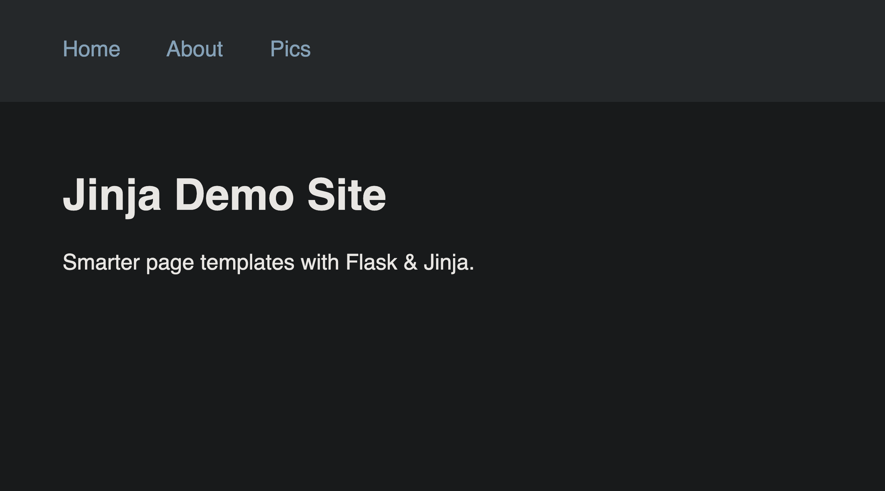
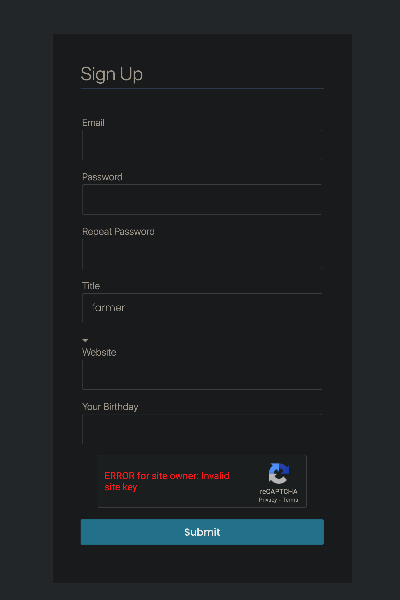
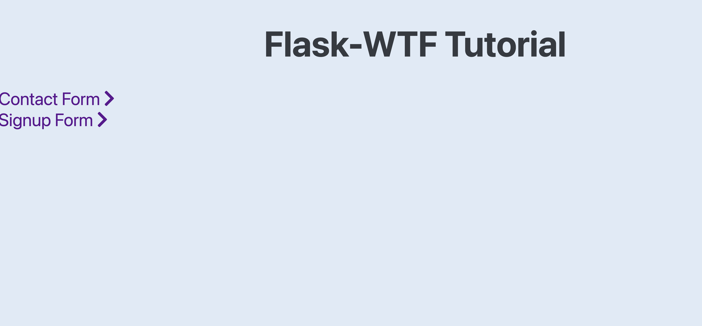
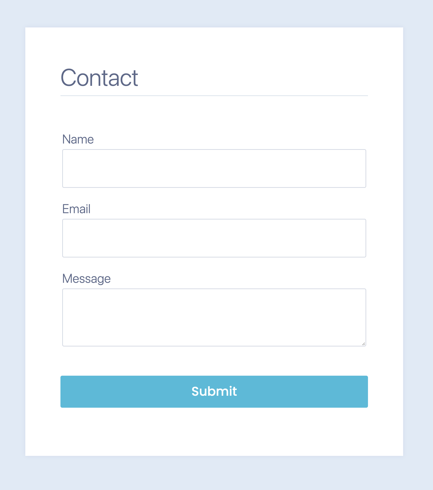
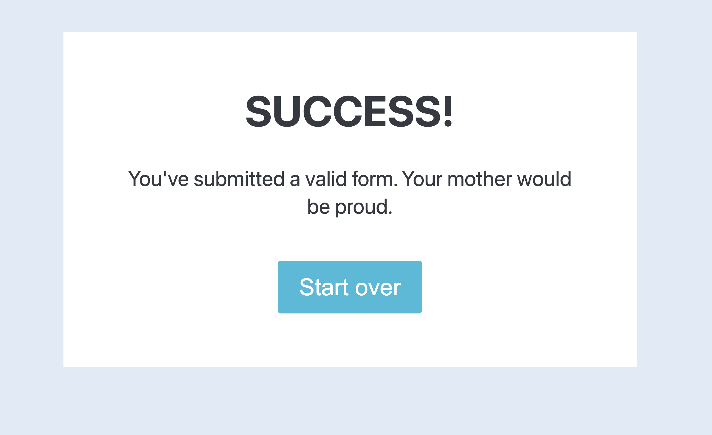
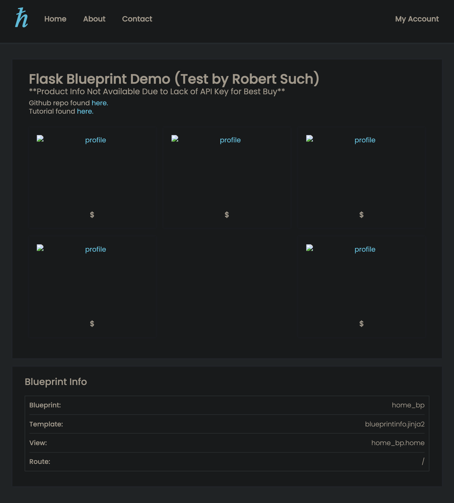
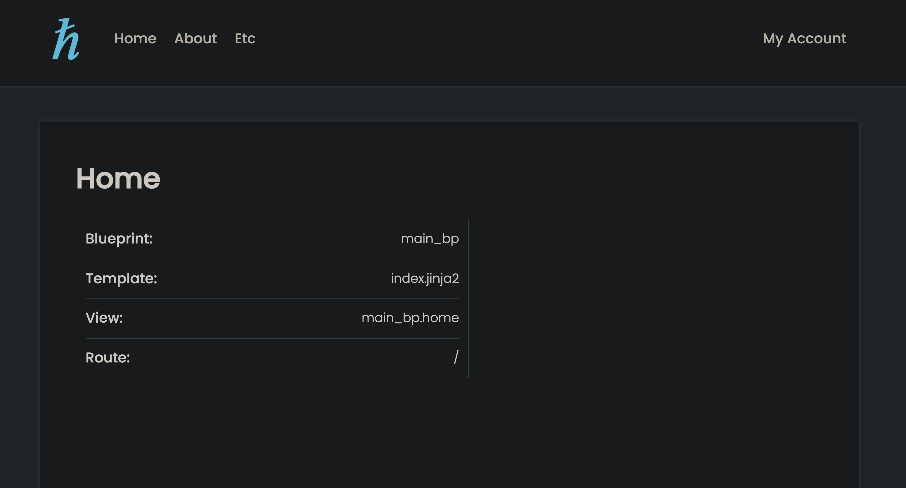
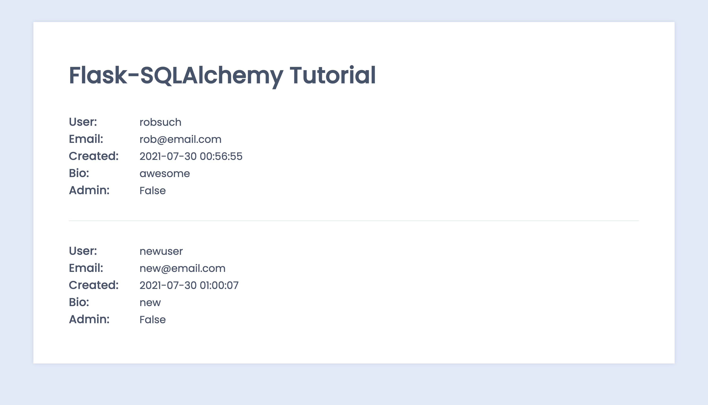
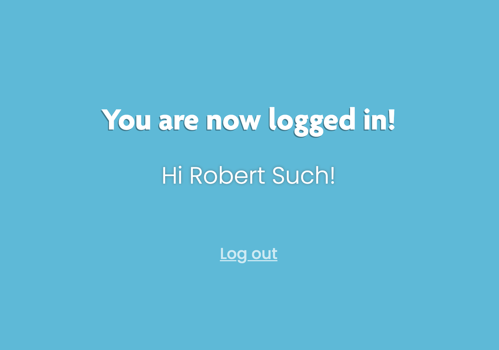
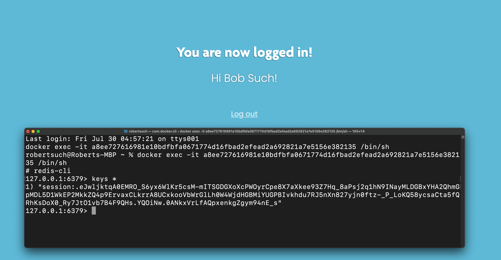

# IS 601 - Final Project:
**This project is to demonstrate the following tasks:**

1. Create Flask Application
2. Render Pages in Flask Using Jinja
3. Handle Forms in Flask with Flask-WTF
4. Routing in Flask
5. Configuring Flask App
6. Flask’s Application Factory
7. Organizing Flask Apps with Blueprints
8. Compiling Frontend JavaScript & Stylesheets Flask
9. Connect Flask to a Database with Flask-SQLAlchemy
10. Handle User Accounts & Authentication in Flask with Flask-Login
11. Managing Session Data with Flask-Session & Redis

**NOTES:**
 - This project is based on the following tutorial:
https://hackersandslackers.com/series/build-flask-apps/
 - Modifications have been made to allow this project to run via a docker-compose setup.
 - Docker-compose-wait is being used to make sure that the redis & mysql containers are up
   and ready to accept connections before flask starts sending requests.
 - Screenshots for each task are listed below.  It should be noted that tasks 4, 5, and 6
   do not actually produce a new or useful output that would serve as a deliverable of sorts
   for the task.  In other words the screen output (i.e. localhost:5000 or other related routes)
   behaves essentially the same as the output for task 3.  In any case I have provided screenshots
   for Tasks 4, 5, and 6 although they just simply show the output for other available routes.
 - The output for Task 7 is not displaying product information in the same way as shown in the
   tutorial since I do not have access to a Best Buy API key.  Such a key is not available to
   students.
   
## Screenshot showing test output of Task 1:

## Screenshot showing test output of Task 2:

## Screenshot showing test output of Task 3:

## Screenshot showing test output of Task 4:

## Screenshot showing test output of Task 5:

## Screenshot showing test output of Task 6:

## Screenshot showing test output of Task 7:

## Screenshot showing test output of Task 8:

## Screenshot showing test output of Task 9:

## Screenshot showing test output of Task 10:

## Screenshot showing test output of Task 11:

