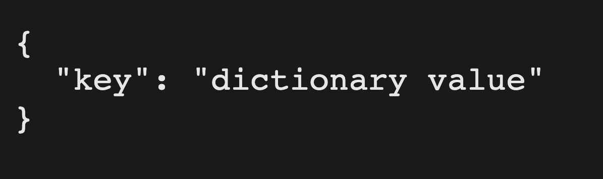

# IS 601 - Final Project:
This project is to demonstrate the following tasks:

1. Create Flask Application
2. Render Pages in Flask Using Jinja
3. Handle Forms in Flask with Flask-WTF
4. Routing in Flask
5. Configuring Flask App
6. Flask’s Application Factory
7. Organizing Flask Apps with Blueprints
8. Compiling Frontend JavaScript & Stylesheets Flask
9. Connect Flask to a Database with Flask-SQLAlchemy
10. Handle User Accounts & Authentication in Flask with Flask-Login
11. Managing Session Data with Flask-Session & Redis

## Screenshot showing test output of Task 1:

